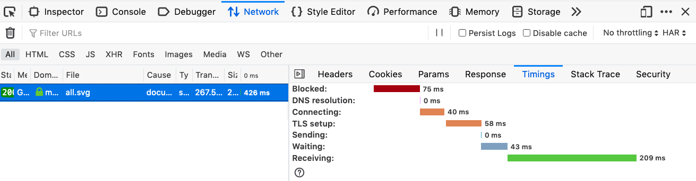

[Web performance](https://developer.mozilla.org/en-US/docs/Learn/Performance)
1. [JS Performance Optimization](https://developer.mozilla.org/en-US/docs/Learn/Performance/JavaScript)
2. [HTML Performance Optimization](https://developer.mozilla.org/en-US/docs/Learn/Performance/HTML)
3. [CSS Performance Optimization](https://developer.mozilla.org/en-US/docs/Learn/Performance/CSS)
4. [Optimizing startup performance](https://developer.mozilla.org/en-US/docs/Web/Performance/Optimizing_startup_performance)
5. [Lazy Loading](https://developer.mozilla.org/en-US/docs/Web/Performance/Lazy_loading)
6. [Optimize long tasks](https://web.dev/optimize-long-tasks/)

# What is Latency?

Latency is generally considered to be the amount of time it takes from when a request is made by the user to the time it takes for the response to get back to that user.

Latency describes the amount of delay on a network or Internet connection. Low latency implies that there are no or almost no delays. 

# Network Timings

On the network tab, you can see how long each request took to complete. We can look at how long a 267.5Kb SVG image asset took to download.



When a request is in a queue, waiting for a network connection it is considered **blocked**. **Blocking** happens when there are too many simultaneous connections made to a single server over HTTP. If all connections are in use, the browser can't download more resources until a connection is released, meaning those requests and resources are blocked.

**DNS resolution** is the time it took to do the DNS lookup. The greater the number of hostnames, the more DNS lookups need to be done.

**Connecting** is the time it takes for a TCP handshake to complete. Like DNS, the greater the number of server connections needed, the more time is spent creating server connections.

**The TLS handshake** is how long it took to set up a secure connection. While a TLS handshake does take longer to connect than an insecure connection, the additional time needed for a secure connection is worth it.

**Sending** is the time taken to send the HTTP request to the server.

**Waiting** is disk latency, the time it took for the server to complete its response. Disk latency used to be the main area of performance concern. However, server performance has improved as computer memory, or CPU, has improved. Depending on the complexity of what is needed from the server, this can still be an issue.

**Receiving** is the time it takes to download the asset. The receiving time is determined by a combination of the network capacity and the asset file size. If the image been cached, this would have been nearly instantaneous. Had we throttled, receiving could have been 43seconds!

# Measuring latency

**Network latency** is the time it takes for a data request to get from the computer making the request, to the computer responding. Including the time it takes for a byte of data to make it from the responding computer back to the requesting computer. It is generally measured as a round trip delay.

**Disk latency** is the time it takes from the moment a computer, usually a server, receives a request, to the time the computer returns the response

# Using dns-prefetch

``DNS-prefetch`` is an attempt to resolve domain names before resources get requested. This could be a file loaded later or link target a user tries to follow.

## Why use dns-prefetch?

When a browser requests a resource from a (third party) server, that cross-origin's domain name must be resolved to an IP address before the browser can issue the request. This process is known as DNS resolution. While DNS caching can help to reduce this latency, DNS resolution can add significant latency to requests. For websites that open connections to many third parties, this latency can significantly reduce loading performance.

``dns-prefetch`` helps developers mask DNS resolution latency. The HTML <link> element offers this functionality by way of a rel attribute value of dns-prefetch. The cross-origin domain is then specified in the href attribute:

### Syntax
```HTML
<link rel="dns-prefetch" href="https://fonts.googleapis.com/" />
```
### Examples

```HTML
<html lang="en">
  <head>
    <meta charset="utf-8" />
    <meta name="viewport" content="width=device-width,initial-scale=1" />
    <link rel="dns-prefetch" href="https://fonts.googleapis.com/" />
    <!-- and all other head elements -->
  </head>
  <body>
    <!-- your page content -->
  </body>
</html>
```

You should place dns-prefetch hints in the <head> element any time your site references resources on cross-origin domains, but there are some things to keep in mind.

## Best practices

There are 3 main things to keep in mind:

1. dns-prefetch is only effective for DNS lookups on cross-origin domains, so avoid using it to point to your site or domain. This is because the IP behind your site's domain will have already been resolved by the time the browser sees the hint.

2. it's also possible to specify dns-prefetch (and other resources hints) as an HTTP header by using the HTTP Link field:

``Link: <https://fonts.googleapis.com/>; rel=dns-prefetch``

3. consider pairing dns-prefetch with the preconnect hint. While dns-prefetch only performs a DNS lookup, preconnect establishes a connection to a server. This process includes DNS resolution, as well as establishing the TCP connection, and performing the TLS handshake—if a site is served over HTTPS. Combining the two provides an opportunity to further reduce the perceived latency of cross-origin requests. You can safely use them together like so:

```HTML
<link rel="preconnect" href="https://fonts.googleapis.com/" crossorigin />
<link rel="dns-prefetch" href="https://fonts.googleapis.com/" />
```
> If a page needs to make connections to many third-party domains, preconnecting them all is counterproductive. The preconnect hint is best used for only the most critical connections. For the others, just use <link rel="dns-prefetch"> to save time on the first step — the DNS lookup.

The logic behind pairing these hints is because support for dns-prefetch is better than support for preconnect. Browsers that don't support preconnect will still get some added benefit by falling back to dns-prefetch. Because this is an HTML feature, it is very fault-tolerant. If a non-supporting browser encounters a dns-prefetch hint—or any other resource hint—your site won't break. You just won't receive the benefits it provides.

Some resources such as fonts are loaded in anonymous mode. In such cases you should set the crossorigin attribute with the preconnect hint. If you omit it, the browser will only perform the DNS lookup.